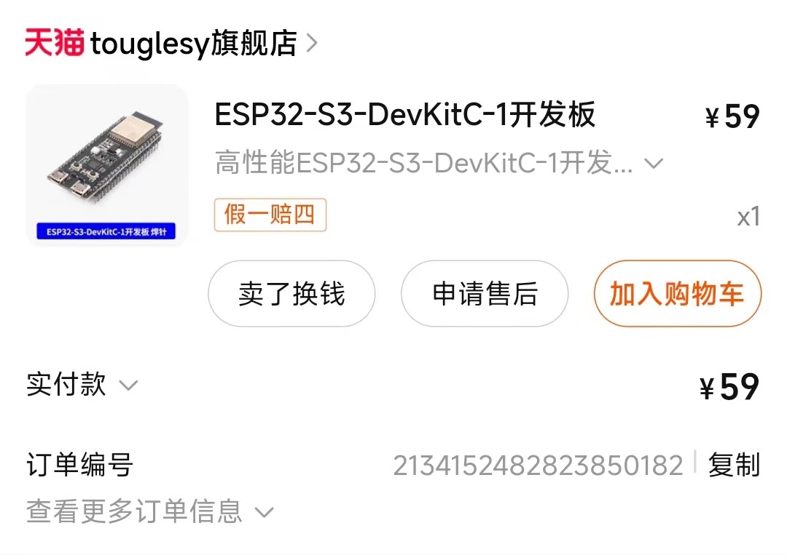
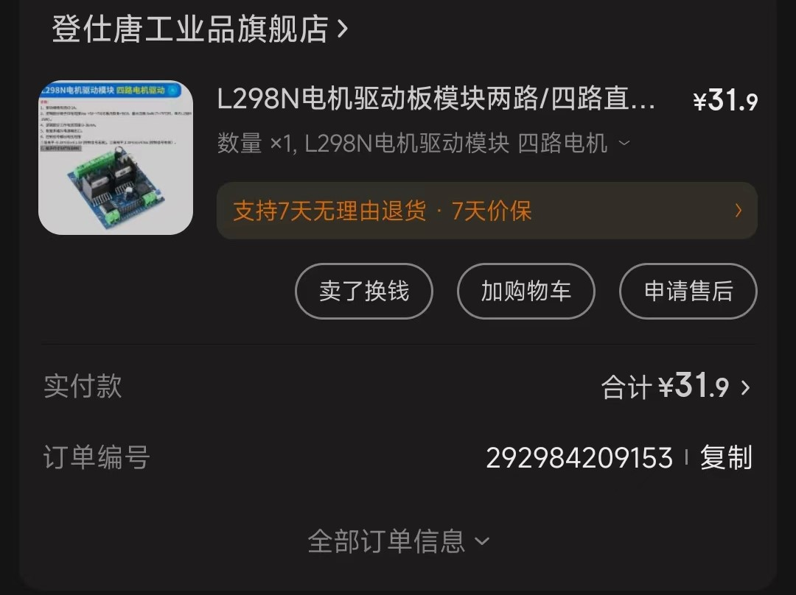
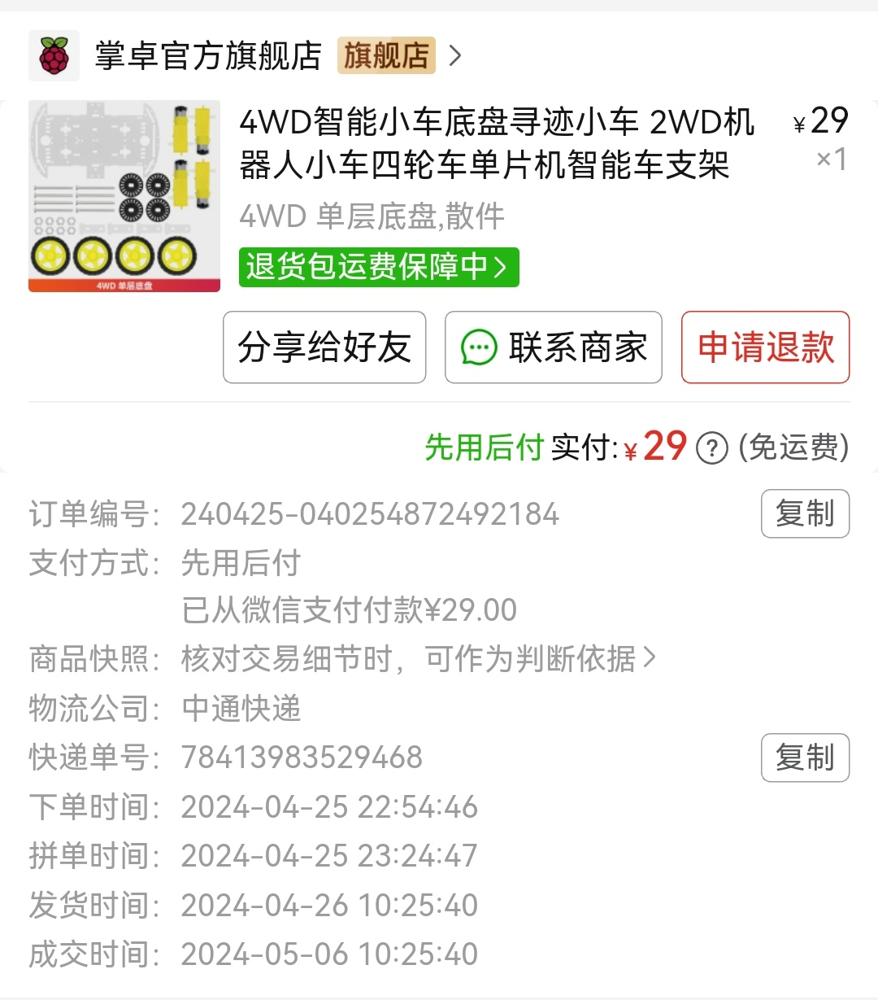

# 👋你好，这是一个基于FPGA Nexys a7 100t的数字逻辑课程设计

## 1. 项目简介

* 本项目实现了以下功能

  

## 2. 组件

* 核心板：Nexys a7 100t
* 无线控制：esp32

  
* 超声测距：MaxSonar(申请pmod)
* 电机驱动：L298N四路(用于控制车的四个轮子)

  

  L298N2路(用于控制弹射装置)
* 车身&电机：

  
* 摄像头：CAM_5M OV5640(申请pmod)

## 3. 项目结构

* new

| 名称                         | 功能                                                     |
| ---------------------------- | -------------------------------------------------------- |
| CarInterface                 | 小车控制接口                                             |
| attack.v                     | 攻击信号产生                                             |
| cemera.v                     | 摄像头模块,用于识别目标 ~~是的，我把camera拼错了~~ |
| ultrasound_distance_detect.v | 超声波距离探测，并显示在数码管                           |
| RemoteCar.v                  | 无线控制                                                 |
| top.v                        | 全综合                                                   |

* ip

| 名称          | 功能       |
| ------------- | ---------- |
| blk_mem_gen_0 | 摄像头读写 |
| clk_wiz_0     | 时钟分频   |

* nexysa7.xdc

*注意* :因为在最后调试阶段attack信号发生问题，所以在约束文件中把距离产生信号的sig和最终的攻击信号attck_signal换了，所以小车的攻击只和超声波距离有关，而无法针对特定目标进行攻击。

## 4. Pmod使用

### Maxsonar超声波测距

[官方使用手册：Pmod MAXSONAR Reference Manual - Digilent Reference](https://digilent.com/reference/pmod/pmodmaxsonar/reference-manual)

根据手册，有三种方式实现测距，我们采用的是PWM信号测距，需要注意的是，串口的接收端要给一个持续的高电平信号

### ov5640摄像头
摄像头实现很复杂，可以参考以下两个开源项目
开源实现：
[YJ-Guan/Xilinx-NEXYS4_DDR-Drives-OV5640: The aiming of this project is to realize the image capture using OV5640 camera and FPGA which transmits the image signal using VGA (Video Graphic Array) standard on an LCD screen. (github.com)](https://github.com/YJ-Guan/Xilinx-NEXYS4_DDR-Drives-OV5640)

[lglglglgy/FPGA_smart_car: FPGA小车， 功能： 自动变速，VGA实时画面输出，目标识别，目标跟踪 ](https://github.com/lglglglgy/FPGA_smart_car)(我们的摄像头部分主要参考这个项目)
## 5. 无线控制
请参考[webcontrol - ESP32](https://github.com/xu-zih/F-GACarWebControl)
## 使用说明

1. 克隆本项目
2. 打开.xpr文件
3. 源文件在/fpga_smrt_car/new/下
演示视频请查看video文件夹
